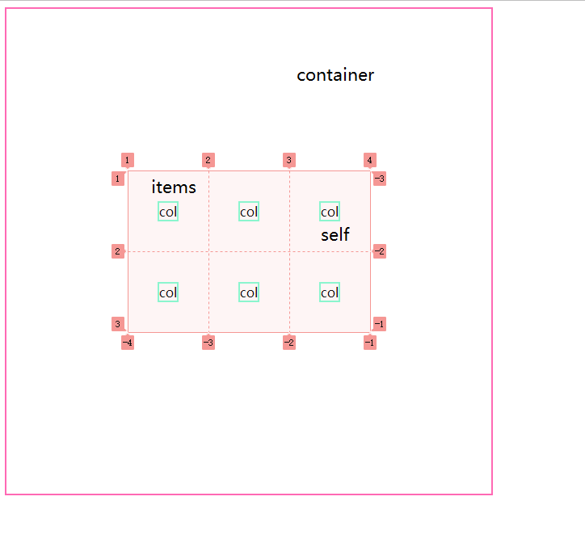

# grid概念

content整体项目(如果项目没有占满整个大盒子)，items所有项目在单独的容器中布局(如果买个小项目没有占满规划好的小容器)，self单独项目自身布局。



# 开启grid

```css
display: grid;
grid-template-columns: 100px 100px 100px;  //repeat(3, 100px);
grid-template-rows: 100px 100px 100px;     //repeat(3, 100px);
```

模板的布局要和容器的长宽一致，或者用单位。

**如果子项目没有指定长宽，则会默认分配给一个格子大小。但是使用了其他的属性时，又会转成内容大小。但是每个item以及整体项目不要超过设定的盒子大小。可以用fr单位占满。**


|           单位           |
| :----------------------: |
|            %             |
|            fr            |
|    100px  auto  100px    |
| repeat(auto-fill, 100px) |
|    minmax(150px, 1fr)    |

# content

content就两个属性，

# gap

```
column-gap: 10px;
row-gap: 10px;

//统一设置
gap:10px 20px;
gap:10px;
```

# 在项目中的排列方式

```
justify-items: center;
align-items: center;
```

```
//统一设置
 place-items: center center;
```

# 单独项目的排列方式

```
justify-self
align-self
```

# grid-auto-flow

子元素的排放方式。

```javascript
row | colum | dense
```

# grid-template-areas

```
grid-template-areas:
'a b c'
'd e f'
'g h i';
```

```
grid-column: 1 / 3;
grid-row: 1 / 2;

//不设置宽高
grid-area:a;
```

# demo

```html
<!DOCTYPE html>
<html lang="en">
    <head>
        <meta charset="UTF-8" />
        <meta http-equiv="X-UA-Compatible" content="IE=edge" />
        <meta name="viewport" content="width=device-width, initial-scale=1.0" />
        <title>Document</title>
        <style>
            div {
                box-sizing: border-box;
            }
            .content {
                display: grid;
                width: 100%;
                max-width: 1200px;
                height: 600px;
                border: 2px solid hotpink;
                grid-template-columns: repeat(3, 1fr);
                grid-template-rows: repeat(3, 1fr);
                justify-content: center;
                align-content: center;
                gap: 10px;
                grid-template-areas: 'header header header' 'nav main main' 'nav footer .';
            }
            .col {
                border: 2px solid aquamarine;
            }
            @media all and (max-width: 750px) {
                .content {
                    grid-template-areas: 'header header header' 'main main main' 'footer footer footer';
                }
                .nav {
                    display: none;
                }
            }
            @media all and (max-width: 550px) {
                .content {
                    grid-template-areas: 'main main main' 'main main main' 'main main main';
                }
                .nav,
                .header,
                .footer {
                    display: none;
                }
            }
            .header {
                grid-area: header;
            }
            .nav {
                grid-area: nav;
            }
            .main {
                grid-area: main;
            }
            .footer {
                grid-area: footer;
            }
        </style>
    </head>
    <body>
        <div class="content">
            <div class="col header">header</div>
            <div class="col nav">nav</div>
            <div class="col main">main</div>
            <div class="col footer">footer</div>
        </div>
    </body>
</html>

```

