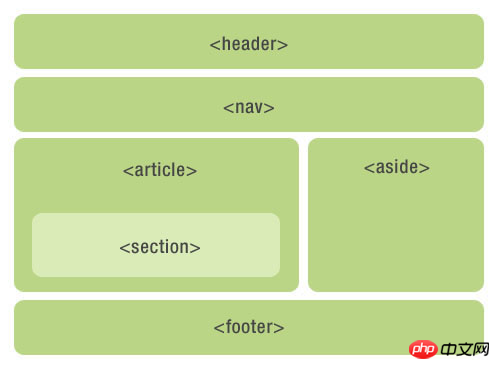

#  HTML重点笔记

## a标签的属性

### 1. 窗口打开方式

| 属性名 |               值               |     默认值      |
| :----: | :----------------------------: | :-------------: |
| target | __blank（在新窗口打开);  _self | _self(当前打开) |

### 2. 锚点定位


| 属性名 |        值         |
| :----: | :---------------: |
|  href  | #name（id选择器） |

选择要跳转的标签的id，在a标签的href属性中设置要跳转的id选择器 

## table表格

### 1. 基本用法

```html
<table>
    <thead>
        <tr>
            <th>...</th>
        </tr>
    </thead>
    <tbody>
    	<tr>
            <td>...</td>
        </tr>
    </tbody>
    <tfood>
    	<tr>
            <td>tfood用于表注，区分于tbody的内容</td>
        </tr>
    </tfood>
</table>
```

### 2. css样式

|    css属性名    |           css值            |
| :-------------: | :------------------------: |
|     rowspan     |    跨行合并单元格的个数    |
|     colspan     |    跨列合并单元格的个数    |
| border-collapse | collapse(合并相邻表格边框) |

## input的属性

|   属性    |                值                |
| :-------: | :------------------------------: |
|   type    |     file; radio;reset;image      |
| maxlength | 正整数（定义输入字段的最大长度） |

### css样式

{

​	border: 2px;

<p style="color:#4D90FE;"> &nbsp &nbsp outline: normal; 蓝色外边框</p>

}


清除样式

{

​	border: 0;

​	outline: none;

}

###  常见问题

<p style="color:red">两个input并列之间有一个默认间隙（不是margin和padding），要用浮动解决。</p>

## label

为input标签增加体验

### 用法

| 属性 |              值               |
| :--: | :---------------------------: |
| for  | input标签的id（不是id选择器） |

## select下拉菜单

### 用法

```html
<select>    
    <option>...</option>
    <option>...</option>
    <option>...</option>
</select>

```

<p style="color:red">select中至少包含一对option</p>

### 属性

|   属性   |                    值                    |
| :------: | :--------------------------------------: |
| selected | selected(当标签含有这个值时，则默认选中) |

# H5新增特性

## 新增的语义化标签



```
<header>: 头部标签
<nav>: 导航标签
<article>: 内容标签
<main>:一个页面只能用一次
<section>: 定义文档某个区域
<aside>: 侧边栏标签
<address>: 地址
<footer>: 尾部标签
```

## 新增多媒体标签

### 1. audio


### 2. video

谷歌浏览器默认禁止自动播放，除非设置静音

```
autoplay
muted
```


